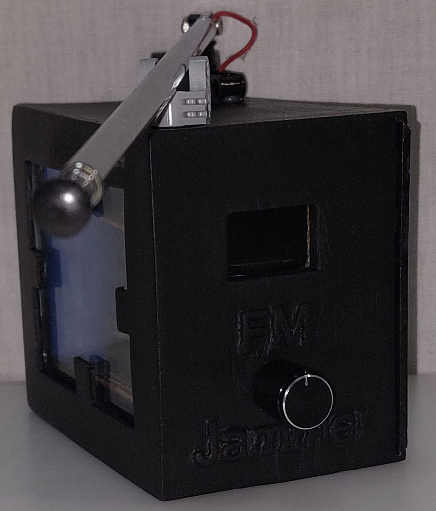
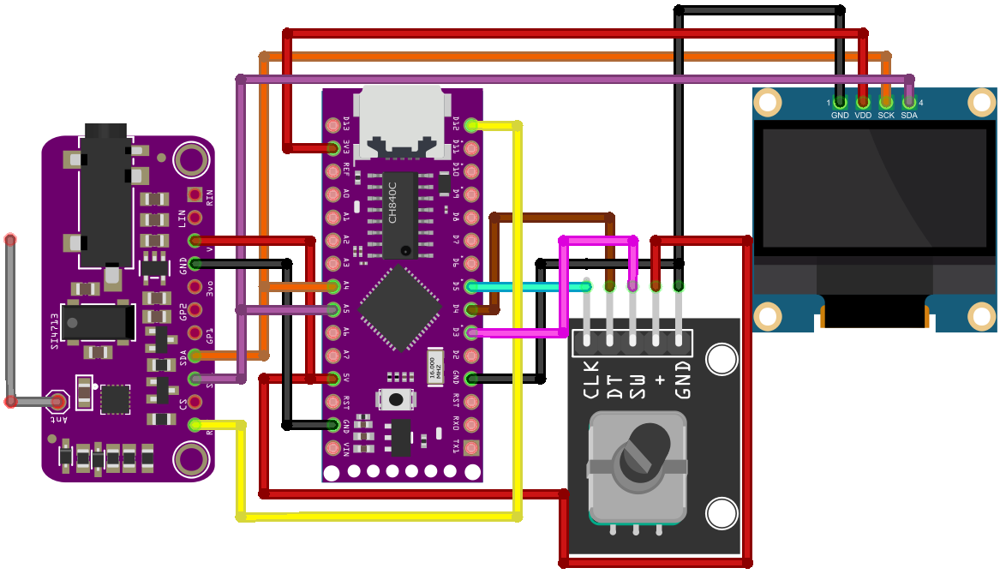

# FM Jammer Project

## ⚠️ Warning

**This is a low-range jammer, but it could interfere with other broadcasts. Please be careful when using it.**

This project is an FM jammer based on Arduino programming language, using the LGT8F328P microcontroller, the SI4713 FM transmitter module, a 0.96" OLED display, and a rotary encoder.

In this repository, you will find the schematic of the circuit and the code required for this project.

## Project Overview

For jamming, we use the FM transmitter module SI4713 with the LGT8F328P microcontroller and a 0.96" OLED [128×64] pixel I2C display to show the transmission frequency of the jammer. The transmission is done within the same FM band used for reception [88–108] MHz. To switch transmission frequencies and change the targeted channels, we use the KY-040 rotary encoder.

## Script Explanation

The main file is **FM_JM_main.ino** The other files are used for controlling the modules, such as **oled.ino**, **SI4713.ino**, and **encoder.ino** Create a folder named **FM_JM_main** and put all these files in it. Open **FM_JM_main.ino** to access everything.

The first step in the script is to declare the necessary libraries, which include:
- `<Wire.h>` for I2C communication.
- `<Adafruit_SSD1306.h>` and `<Adafruit_GFX.h>` for controlling the OLED display.
- `<BfButton.h>` for controlling the encoder button.
- `<Adafruit_Si4713.h>` for managing the SI4713 module.

Next, we declare the variables, including the pins used, the frequency value, the maximum and minimum frequencies, an index to indicate the position in the vector of FM radio channels, variables for the state of the encoder, and the specifics of the model. Various functions are defined to control the system, and the OLED screen and SI4713 module are initialized.

The system starts by displaying the FM Jammer logo, followed by the system instructions.

The system control involves several conditions managed by the encoder button:
- Double-clicking starts jamming at the initial frequency of 98 MHz with a 100 kHz step and an index of 0, which corresponds to the first channel with a frequency of 88.4 MHz, displaying the current frequency.
- A long click can change the step from 100 kHz to 1 MHz or vice versa.

The second block of conditions is controlled by the rotation of the encoder:
- Rotating to the right adds the frequency step to the current frequency and increases the index.
- Rotating to the left subtracts the frequency step from the current frequency and decreases the index.

To ensure that both the frequency and the index are within the desired range of [88–108] MHz for the frequency and 0 to 12 for the index, if it exceeds this range, it will revert to the minimum value; if it is below, it will jump to the maximum value.

The final condition determines the chosen mode. If there is a click on the encoder, the frequency will be that of the channel corresponding to the index; otherwise, it will be the one obtained by rotating the encoder. The obtained frequency value is then sent to the radio module, thus jamming that frequency, and displayed on the OLED screen.

##  Issue

This jammer can only jam one channel at a time. If you can provide any additional modifications or improvements, that would be greatly appreciated.
